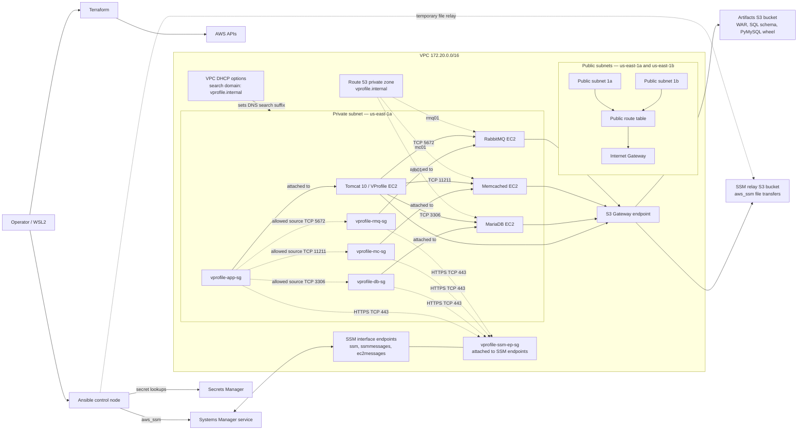
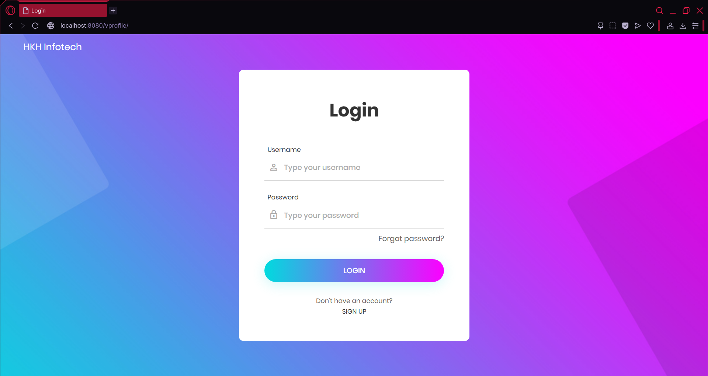

# VProfile on AWS with Terraform and Ansible

This project recreates the AWS infrastructure for the VProfile application using Terraform, then configures its servers with Ansible.

VProfile is an instructor-provided Java reference application used here to practice infrastructure automation and deployment. This repository deploys four service tiers: Tomcat, MariaDB, Memcached, and RabbitMQ. It does not provision Nginx.

This is Project 2 in a five-project DevOps portfolio. It follows a manual AWS deployment and uses Infrastructure as Code to make the environment reproducible and easier to verify.

## Problem and goal

The first portfolio project built the architecture manually with AWS CLI commands and startup scripts. This project moves that work into declarative infrastructure and repeatable server configuration. The goal was to reproduce the verified architecture, then test it with a full destroy-and-rebuild cycle and a second Ansible run.

## What this project demonstrates

- Provisioning AWS networking, EC2 instances, security groups, IAM, and private DNS with Terraform.
- Configuring Linux servers and application services with Ansible roles.
- Connecting to private instances through AWS Systems Manager Session Manager instead of SSH.
- Retrieving credentials from AWS Secrets Manager during configuration.
- Checking Ansible idempotency by running the playbook again after convergence.
- Rebuilding the environment and verifying that DNS records follow replacement instances.

## Architecture

Terraform creates a VPC with two public subnets and one private subnet. The four application instances run in the private subnet:

- **Tomcat 10** serves the VProfile application.
- **MariaDB** stores application data.
- **Memcached** provides caching.
- **RabbitMQ** provides messaging.

The application uses private Route 53 records for the database, cache, and message broker. The VPC DHCP option set supplies `vprofile.internal` as the DNS search suffix. Backend security groups allow service-port ingress from the application security group; the SSM endpoint security group permits HTTPS from the service security groups. A separate S3 Gateway endpoint provides private-subnet access to both the artifacts bucket and the SSM relay bucket.

The operator runs Terraform and Ansible from a control machine. Ansible connects through SSM and uses S3 for file transfers. The application was verified through SSM port forwarding.



The application security group permits TCP 8080 from `vprofile-alb-sg`, which Terraform defines, but no Application Load Balancer is provisioned or attached to that security group. The application has no public web endpoint in this project; it was verified through SSM port forwarding.



*The application login page, reached through SSM port forwarding.*

## Technology choices

| Technology | Purpose and reason |
|---|---|
| Terraform | Declares AWS infrastructure and allows changes to be reviewed with `plan`. |
| Ansible | Installs and configures services after instance creation, keeping server configuration separate from infrastructure provisioning. |
| AWS Systems Manager | Provides instance access without inbound SSH or public IPs. It is also Ansible's connection transport. |
| AWS Secrets Manager | Stores database and RabbitMQ credentials used during configuration. |
| Amazon S3 | Hosts the application WAR, database schema, Python wheel, and SSM transfer files. |
| Amazon Linux 2023 | Operating system used by the EC2 instances. |

RabbitMQ is installed by Ansible from upstream repositories rather than baked into an image. PyMySQL, a Python dependency unavailable from the configured AL2023 repositories, is delivered as a wheel through S3. The private subnet has no permanent internet route, so a clean RabbitMQ package bootstrap requires temporary outbound access. The temporary NAT resources used for bootstrap were removed from the Terraform code afterward.

Terraform owns the VPC, subnets, routing, security groups, IAM, EC2, and DNS. Ansible owns packages, service configuration, application configuration, and service startup.

## Prerequisites and environment configuration

- An AWS account with credentials configured for Terraform, AWS CLI, and Ansible.
- AWS region `us-east-1`, which the project targets by default.
- Terraform 1.16 or later. The project was verified with Terraform 1.16.1 and AWS provider `~> 5.31.0`.
- Ansible and the `amazon.aws`, `community.aws`, `ansible.mysql`, and `community.rabbitmq` collections. The verified control node used Ansible 14.4.0 / ansible-core 2.21.4.
- AWS Systems Manager Session Manager support on the control machine.
- Permission to use the required EC2, IAM, Systems Manager, S3, Route 53, and Secrets Manager resources.

The Ansible roles expect these Secrets Manager entries:

- `vprofile/db/admin-password`
- `vprofile/db/app-password`
- `vprofile/rmq/test-password`

The artifacts bucket configured in the Ansible tasks must contain:

- `app/vprofile-v2.war`
- `db/accountsdb.sql`
- `deps/pymysql-1.2.3-py3-none-any.whl`

The S3 transfer bucket named in `ansible/inventory/hosts.yml` must also exist and be accessible to the Ansible control machine. Terraform does not create these buckets or upload these artifacts.

Some IAM ARNs and S3 bucket references in the repository are account-specific. Update those references and confirm the secrets and artifacts are available before deploying into another AWS account. Do not put secret values in the repository.

## Deployment

Terraform state is local and excluded from Git. Preserve the state file between runs so Terraform can track the resources it manages. Review the plan before applying or destroying infrastructure.

### 1. Confirm AWS credentials and region

```bash
aws sts get-caller-identity
```

Make sure the AWS CLI and Terraform use the intended AWS account and `us-east-1` region.

### 2. Initialize and review Terraform

```bash
terraform -chdir=terraform init
terraform -chdir=terraform validate
terraform -chdir=terraform plan
```

After reviewing the plan, provision the infrastructure:

```bash
terraform -chdir=terraform apply
```

### 3. Prepare Ansible connectivity

The current Ansible inventory contains EC2 instance IDs from one deployment. After creating or recreating instances, update the IDs in `ansible/inventory/hosts.yml` to match the current instances.

Wait for the instances to register as managed instances in Systems Manager; this can take several minutes after Terraform finishes. Confirm that the SSM transfer bucket is available to the Ansible control machine.

Install the required collections if they are not already present:

```bash
ansible-galaxy collection install amazon.aws community.aws ansible.mysql community.rabbitmq
```

### 4. Bootstrap RabbitMQ and configure the services

The private subnet has no permanent internet egress. On a clean deployment, RabbitMQ package installation needs temporary outbound access to upstream repositories. The temporary NAT setup is not currently present in Terraform source; follow the bootstrap procedure documented in `NOTES.md` before configuring a newly created RabbitMQ instance.

Then run the playbook:

```bash
ansible-playbook -i ansible/inventory/hosts.yml ansible/playbook.yml
```

### 5. Access the application

Start an SSM port-forwarding session to the current Tomcat instance:

```bash
aws ssm start-session \
  --target <tomcat-instance-id> \
  --document-name AWS-StartPortForwardingSession \
  --parameters '{"portNumber":["8080"],"localPortNumber":["8080"]}'
```

With the session running, open:

```text
http://localhost:8080/vprofile/
```

## Verification

The project was verified against a live AWS environment:

- Terraform destroyed and recreated the environment from an empty state.
- All four Ansible roles completed successfully.
- A second full playbook run reported `changed=0, failed=0` on all four hosts.
- The application returned HTTP 200 at `/vprofile/` through the Tomcat host.
- Tomcat reached MariaDB, Memcached, and RabbitMQ on their expected ports.
- Route 53 records updated to the replacement backend instances' private IPs after rebuild.

To check idempotency after a successful configuration run, run the playbook again:

```bash
ansible-playbook -i ansible/inventory/hosts.yml ansible/playbook.yml
```

## Security notes

- Instances are managed through SSM; the project does not require inbound SSH access or public IPs on the service instances.
- Backend security groups allow database, cache, and RabbitMQ ingress from the application security group on their service ports. The application security group permits port 8080 from the ALB security group, although no ALB is provisioned. Security group egress rules are broad.
- Ansible retrieves credentials from Secrets Manager and suppresses secret-bearing task output with `no_log` where configured. The control machine's AWS credentials must be permitted to perform the Ansible lookups.
- The Tomcat role renders the database and RabbitMQ credentials into `application.properties` on the instance, owned by `tomcat:tomcat` with mode `0640`. The values are not committed to Git.
- The EC2 role includes Systems Manager access, S3 artifact access, and scoped Secrets Manager access. Review account-specific IAM ARNs before reuse.
- Terraform state, private keys, and secret files are excluded by `.gitignore`.

## Troubleshooting

- **An instance is unavailable through SSM:** allow time for registration, then check the instance profile, endpoint configuration, AWS credentials, and S3 transfer bucket access.
- **Ansible targets old instances:** refresh the EC2 instance IDs in `ansible/inventory/hosts.yml` after each rebuild.
- **The application cannot reach a backend:** check private DNS resolution and security group rules for TCP 3306, 11211, and 5672.
- **The application returns 404:** confirm the WAR deployed under the `/vprofile` context and that the Tomcat 10 service is running. The project previously resolved a Jakarta/Servlet compatibility issue by moving from Tomcat 9 to Tomcat 10.
- **RabbitMQ package installation times out:** the private subnet has no permanent internet route. Use the documented temporary NAT bootstrap for a new instance.
- **Ansible reports changes repeatedly:** check for drift and review tasks that import database data or fetch external keys. The roles include state checks for these operations.

## Cleanup

Review the destroy plan, then remove Terraform-managed resources when finished:

```bash
terraform -chdir=terraform plan -destroy
terraform -chdir=terraform destroy
```

Destroying the database EC2 instance also removes its local database data. S3 buckets and their contents are not managed by this Terraform configuration and need separate cleanup if no longer required. AWS resources can incur charges while they exist.

## Lessons learned

- A successful first run does not prove Ansible idempotency. The second full run exposed issues in MariaDB authentication, schema import behavior, and RabbitMQ signing-key checks.
- A hard-coded DNS record does not follow a replaced instance. Referencing the instance's private IP in Terraform lets the record update on rebuild.
- A successful DNS lookup can still return a stale address; verify the record against the current instance.
- The application requires Tomcat 10 for the verified deployment.
- Application configuration should receive real secrets at deployment time rather than relying on credentials baked into the WAR's defaults.

## Limitations and production considerations

This is a learning project, not a production-ready deployment.

- Each service runs on a single EC2 instance in one private subnet and Availability Zone; there is no high availability or horizontal scaling.
- The repository does not provision an ALB, managed database, managed cache, or managed message broker.
- Terraform uses local state rather than a shared remote backend with locking.
- The Ansible inventory is static and must be refreshed when instance IDs change.
- RabbitMQ's temporary outbound bootstrap is a documented manual step, not an automated workflow.
- Required S3 buckets and artifacts are external prerequisites rather than Terraform-managed resources.
- There is no CI/CD pipeline or automated test suite; verification uses Terraform plans, live service checks, application requests, and Ansible reruns.
- The MariaDB application user is scoped to the `accounts` database, while the RabbitMQ `test` user has administrator permissions on the default vhost.

For a production system, I would use shared and locked Terraform state, dynamic inventory, automated artifact distribution, a multi-AZ service design, load balancing, managed services where appropriate, backup and restore procedures, monitoring, and tighter RabbitMQ permissions. I would also parameterize account-specific resources and add automated validation in CI.

## Repository structure

```text
.
├── .gitignore
├── ansible/
│   ├── inventory/hosts.yml
│   ├── playbook.yml
│   └── roles/
│       ├── mariadb/
│       ├── memcached/
│       ├── rabbitmq/
│       └── tomcat/
├── docs/
│   ├── architecture.md
│   ├── course-coverage.md
│   ├── decisions.md
│   ├── incidents.md
│   └── images/vprofile-login-page.png
├── terraform/
│   ├── ec2.tf
│   ├── iam.tf
│   ├── main.tf
│   ├── outputs.tf
│   ├── security_groups.tf
│   ├── variables.tf
│   └── versions.tf
├── NOTES.md
└── PROGRESS.md
```

See `PROGRESS.md` for the current implementation state and `NOTES.md` for the session-by-session learning record.


