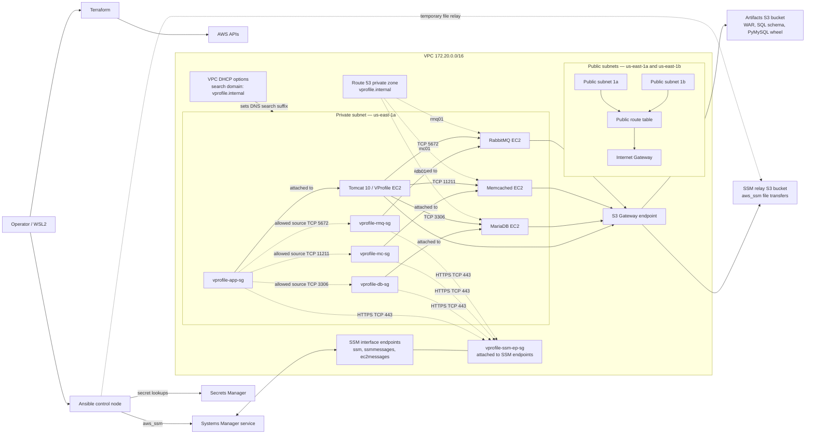

# VProfile AWS Architecture

## Scope

This describes the infrastructure and service configuration represented in this repository. It documents the implemented design, not a production target.

Terraform creates one VPC (`172.20.0.0/16`), two public subnets in `us-east-1a` and `us-east-1b`, and one private subnet (`172.20.3.0/24`) in `us-east-1a`. Four `t3.micro` EC2 instances run in the private subnet: Tomcat 10, MariaDB, Memcached, and RabbitMQ. The public subnets route through an Internet Gateway; no application instances, ALB, or permanent NAT Gateway are deployed there. The private subnet has no general internet route.

## Diagram

The two S3 buckets are separate resources with separate purposes: the artifact bucket stores the WAR, SQL schema, and PyMySQL wheel; the SSM relay bucket is used by Ansible's `aws_ssm` connection plugin. Their current names are configured in the Ansible files. Neither bucket is created by this Terraform configuration.

## Components and boundaries

| Component | Implemented behavior |
|---|---|
| Public network | Two public subnet associations use a route table with a default route to the Internet Gateway. No ALB or NAT Gateway remains in the code. |
| Private network | One private subnet and route table; local VPC traffic and S3 Gateway endpoint route, but no general internet route. |
| EC2 | Four Amazon Linux 2023 `t3.micro` instances in the private subnet, each with a service security group and shared instance profile. |
| Service security groups | DB ingress TCP 3306, cache TCP 11211, and RabbitMQ TCP 5672 accept traffic from `vprofile-app-sg`. App ingress TCP 8080 accepts traffic from `vprofile-alb-sg`. |
| SSM endpoint security group | `vprofile-ssm-ep-sg` permits HTTPS TCP 443 from the four service security groups. |
| SSM endpoints | Interface endpoints for `ssm`, `ssmmessages`, and `ec2messages`; instances use `AmazonSSMManagedInstanceCore`. |
| S3 endpoint | Gateway endpoint associated with the private route table for S3 access from private instances. |
| Private DNS | Route 53 private zone `vprofile.internal`, with records for `db01`, `mc01`, and `rmq01`; records reference current EC2 private IP attributes. |
| DHCP | VPC DHCP option set uses AmazonProvidedDNS and sets `vprofile.internal` as the search domain so the application's short hostnames resolve. |
| Secrets and IAM | Ansible looks up database and RabbitMQ credentials from Secrets Manager and renders Tomcat properties. The EC2 role has SSM access and scoped S3/Secrets Manager policies; account-specific ARNs remain in source. |

All security groups currently allow unrestricted egress. Their inbound rules are narrower as described above. The Terraform code defines `vprofile-alb-sg`, but no ALB, listener, or target group is provisioned. The app was verified through SSM port forwarding, not a public web endpoint.

## Runtime flow

1. Terraform provisions the VPC, routes, endpoints, security groups, IAM, EC2, DHCP options, and private DNS.
2. Ansible targets EC2 instance IDs in `ansible/inventory/hosts.yml` and connects with `community.aws.aws_ssm`.
3. Ansible uses the SSM relay bucket for file transfers. The roles fetch application artifacts from the separate artifacts bucket.
4. Secrets Manager lookups use the AWS credentials available to the Ansible control node. The Tomcat role renders the application properties file with mode `0640`.
5. Tomcat reaches the three backends over private DNS and TCP ports 3306, 11211, and 5672.

## Verification evidence

The project records a full Terraform destroy/recreate, successful backend TCP checks from Tomcat, HTTP 200 from `/vprofile/`, and a second full Ansible run with `changed=0, failed=0` on all four hosts. The login screenshot is stored at `docs/images/vprofile-login-page.png`.

Implementation references: `terraform/main.tf`, `terraform/security_groups.tf`, `terraform/iam.tf`, `terraform/ec2.tf`, `ansible/playbook.yml`, and `ansible/inventory/hosts.yml`. Terraform state is local; no remote backend is configured.

